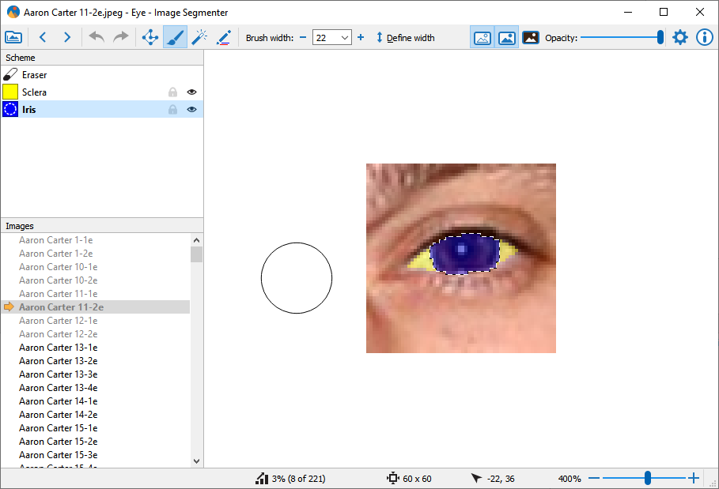

# Image Segmenter

Image Segmenter is a simple program to create segmentation images (or masks) of your images.

## Third-party

* Qt 5.12.2, [license][1]
* maxflow 3.03, [license][2]

## Credits

The interface of the program is mainly adopted from the great web util from this [video][3]. Additionally when searching segmentation tools available i came across  [Interactive Segmentation Tool][4] - the util that does automatic graph-based binary segmentation and decided to include the same tool (Segmentation Pencil tool) in the program.

[1]: https://doc.qt.io/qt-5/lgpl.html
[2]: https://www.gnu.org/licenses/gpl-3.0.en.html
[3]: https://www.youtube.com/watch?v=lUIU2_HW4Ic
[4]: http://web.archive.org/web/20110827170646/http://kspace.cdvp.dcu.ie/public/interactive-segmentation/index.html